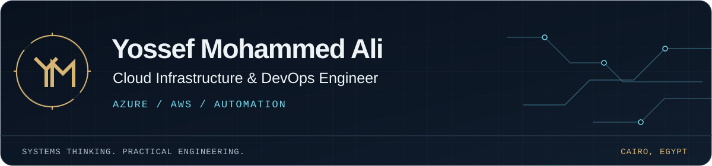

<a href="https://yossefseit.github.io/"><picture><source media="(max-width: 480px)" srcset="assets/profile-header-mobile.svg"></picture></a>

# Yossef Mohammed Ali

**Cloud Infrastructure & DevOps Engineer** · Cairo, Egypt · Open to remote & relocation

I support enterprise and manufacturing infrastructure across systems, identity, networking, virtualization, backup, and recovery. My personal projects bring that operations foundation into GitHub Pages application delivery and Azure infrastructure automation, while I build AWS, Terraform, and Kubernetes skills through ongoing coursework and labs.

**[Portfolio][portfolio] · [Download CV][cv] · [LinkedIn][linkedin] · [Contact][contact]**

## Selected engineering work

### 01 / [Egypt Salary Calculator][salary-repo]

A React and TypeScript application that makes Egyptian salary calculations easier to inspect, with a tested static build delivered through GitHub Actions to GitHub Pages.

`React` `TypeScript` `GitHub Pages` `GitHub Actions`

**80 tests passing; deployed to GitHub Pages.** Deployment and the live salary calculation were verified on **9 Sep 2026**. The browser obtains a dated USD/EGP reference rate directly, without sending salary values to the provider. The former Azure App Service deployment remains available as dated historical evidence from **15 Aug 2026**.

[Case study][salary-case] · [Live calculator][salary-demo] · [Code][salary-repo] · [CI workflow][salary-ci] · [Pages deployment][salary-pages] · [Historical Azure deployment][salary-deployment]

### 02 / [Secure Azure Hub-and-Spoke Lab][hub-repo]

Modular Bicep for a segmented hub, application, and data network: peering, routing, NSGs, ASGs, Private Link, and Private DNS, with lifecycle scripts and ownership-checked cleanup.

`Azure networking` `Bicep` `Private Link` `Bash` `PowerShell`

**Lab: CI validated; Azure deployment pending.**

[Case study][hub-case] · [Code][hub-repo] · [Pipeline evidence][hub-pipeline]

### 03 / [Azure Governance Automation Lab][governance-repo]

Subscription-scoped Bicep for audit-first Azure Policy, RBAC, budgets, and resource locks, with offline failure tests and guarded deployment and cleanup scripts.

`Azure Policy` `RBAC` `Bicep` `GitHub Actions` `Bash` `PowerShell`

**Lab: CI validated; Azure deployment pending.**

[Case study][governance-case] · [Code][governance-repo] · [Pipeline evidence][governance-pipeline]

**More work:** [GitHub Pages Portfolio][portfolio-repo] — static delivery and GitHub Actions. [Samba AD DC Lab][samba-repo] — **Lab: CI validated; runtime validation pending.**

## Engineering toolkit

| Focus | Technologies and practical context |
| --- | --- |
| **Cloud** | Azure networking, identity, compute, storage, monitoring, and backup; AWS coursework and labs |
| **Automation** | Bicep, Bash, PowerShell; Terraform and Ansible through ongoing coursework and labs |
| **Delivery** | Git, GitHub Actions, OIDC; Docker, GitLab CI/CD, Kubernetes, Helm, and Argo CD coursework and labs |
| **Systems** | Windows Server, Linux, AD DS, DNS, DHCP, VMware, Hyper-V, Proxmox; switching, VLANs, VPNs, and firewalls |
| **Reliability** | Incident troubleshooting, Veeam, backup and recovery testing, storage; developing observability skills with Prometheus, Grafana, and ELK |

## Professional experience

| Role | Organisation | Dates |
| --- | --- | --- |
| **IT Infrastructure Analyst** | Electrolux Group | Mar 2026–Present |
| **IT Infrastructure and Systems Specialist** | Aegis | Jun 2025–Jan 2026 |
| **IT Specialist** | El Mostafa for Master Batch | Jul 2022–Jul 2024 |

My professional work covers enterprise and factory infrastructure operations. The cloud applications and labs above are personal projects. [Experience and responsibilities][experience]

## Learning, with intent

- **Route Academy · DevOps Engineering Diploma — in progress.** Aug 2026–expected Feb 2027. Linux, Git, AWS, Terraform, Ansible, Docker, CI/CD, Kubernetes, monitoring, DevSecOps, and GitOps through coursework and labs.
- **IT-Gate Academy · Azure Cloud Engineering Program.** Dec 2024–Jun 2025 · **220 training hours** · Very Good. Azure, Veeam, networking, and Windows Server coursework.
- **IT-Gate Academy · IT Infrastructure Program.** Jan–Apr 2024 · **240 training hours** · Very Good. Networking, Windows Server, Fortinet, and Sophos coursework.

**BSc in Management Information Systems** · El Shorouk Academy · Aug 2019–Sep 2023.

Academy programs describe training, not passed vendor certification exams. Full course detail and career history are in the [CV][cv].

---

**[Explore the portfolio][portfolio] · [Read the infrastructure notes][infrastructure] · [Get in touch][contact]**

[contact]: mailto:yossefali67@gmail.com
[cv]: https://yossefseit.github.io/Yossef_Mohammed_Ali_CV.pdf
[experience]: https://yossefseit.github.io/experience/
[governance-case]: https://yossefseit.github.io/projects/azure-governance-automation/
[governance-pipeline]: https://github.com/yossefseit/azure-governance-automation/actions/workflows/ci.yml
[governance-repo]: https://github.com/yossefseit/azure-governance-automation
[hub-case]: https://yossefseit.github.io/projects/azure-secure-hub-spoke/
[hub-pipeline]: https://github.com/yossefseit/azure-secure-hub-spoke/actions/workflows/validate.yml
[hub-repo]: https://github.com/yossefseit/azure-secure-hub-spoke
[infrastructure]: https://yossefseit.github.io/infrastructure/
[linkedin]: https://linkedin.com/in/yossef-ali
[portfolio]: https://yossefseit.github.io/
[portfolio-repo]: https://github.com/yossefseit/yossefseit.github.io
[salary-case]: https://yossefseit.github.io/projects/egypt-salary-calculator/
[salary-ci]: https://github.com/yossefseit/egypt-salary-calculator/actions/workflows/ci.yml
[salary-deployment]: https://github.com/yossefseit/egypt-salary-calculator/actions/runs/31909528455
[salary-demo]: https://yossefseit.github.io/egypt-salary-calculator/
[salary-pages]: https://github.com/yossefseit/egypt-salary-calculator/actions/runs/34402180941
[salary-repo]: https://github.com/yossefseit/egypt-salary-calculator
[samba-repo]: https://github.com/yossefseit/samba-ad-dc-lab
